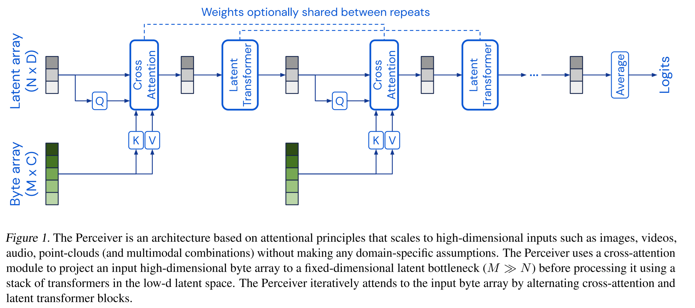

# Perceiver [](https://twitter.com/intent/tweet?text=Wow:&url=https%3A%2F%2Fgithub.com%2FRishit-dagli%2FPerceiver)


[](https://github.com/Rishit-dagli/Perceiver/actions/workflows/black.yml)
[](https://github.com/Rishit-dagli/Perceiver/actions/workflows/python-publish.yml)
[](https://github.com/psf/black)

[](LICENSE)
[](https://github.com/Rishit-dagli/Perceiver/stargazers)
[](https://github.com/Rishit-dagli)
[](https://twitter.com/intent/follow?screen_name=rishit_dagli)

This Python package implements [Perceiver: General Perception with Iterative Attention](https://arxiv.org/abs/2103.03206) by Andrew Jaegle in TensorFlow. This model builds on top 
of Transformers such that the data only enters through the cross attention mechanism (see figure) and allow it to scale to hundreds of thousands of inputs, like ConvNets. This, in 
part also solves the Transformers Quadratic compute and memory bottleneck.

Yannic Kilcher's [video](https://youtu.be/P_xeshTnPZg) was very helpful.



## Installation

Run the following to install:

```sh
pip install perceiver
```

## Developing `perceiver`

To install `perceiver`, along with tools you need to develop and test, run the following in your virtualenv:

```sh
git clone https://github.com/Rishit-dagli/Perceiver.git
# or clone your own fork

cd perceiver
pip install -e .[dev]
```
